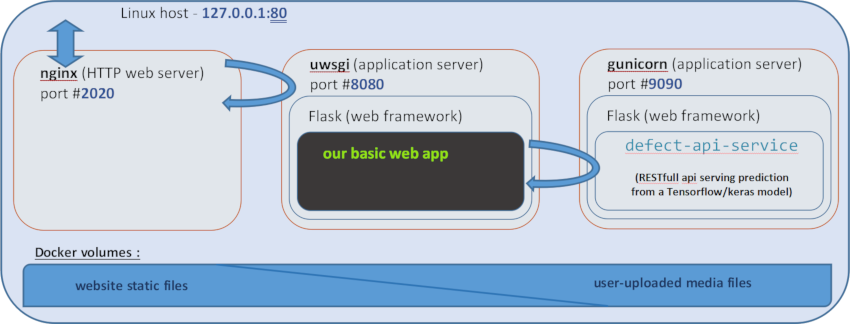
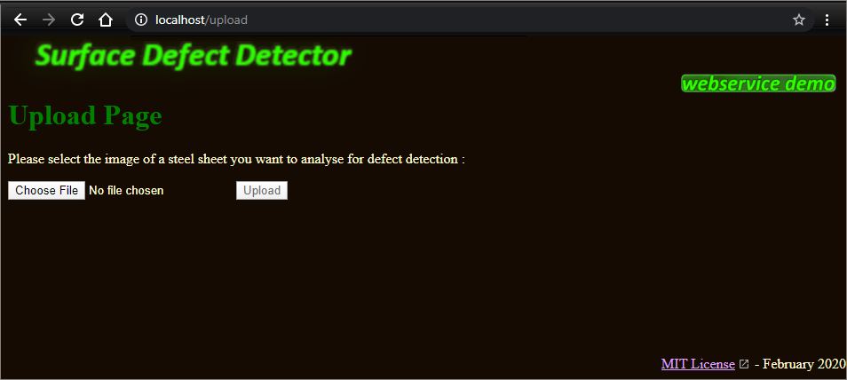
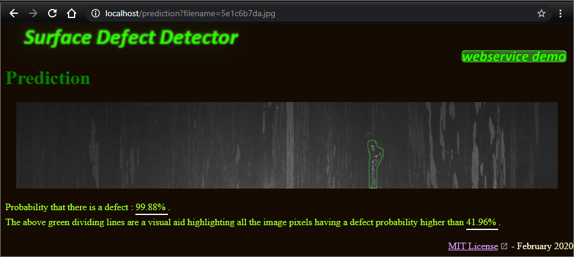
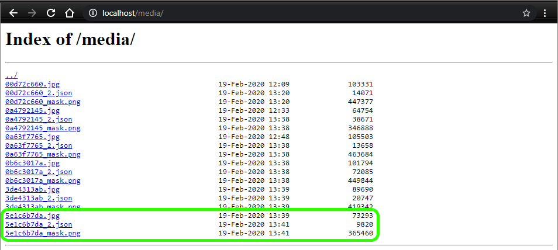

# Surface Defect Detector

Welcome to this demonstration platform  ! 

The goal is to demonstrate how to easily integrate a Tensorflow/Keras model into a microservice architecture to provide predictions on the fly.

The use case is surface defect detection from flat steel sheet images.

The architecture employed is made-up of 3 Docker containers as follows : 



The key element here is the webservice named ```defect-api-service```
which is responsible for the generation of the prediction.
Given an input image, it operates the surface defect detection
and returns an augmented image and probability informations.

To illustrate its usage, the prediction webservice has been integrated into
a basic web platform :

>```http://localhost/upload``` :
select the image for anaysis<br />


<br />

>```http://localhost/prediction?filename=5e1c6b7da.jpg``` :
result of the prediction as returned by ```defect-api-service```<br />


<br />

>```http://localhost/media/``` :
list of media file<br />


For each image submitted for defect detection,
the ```defect-api-service``` stores three different files :
- the original image itself
- a json representation of the prediction
- the image with an overlayed contour
of the detected defectuous area (if any)

<br />

For details on the model architecture and training
as well as on what the reported probabilities do measure,
please kindly refer to <a alt="jupyter notebook" href="https://htmlpreview.github.io/?https://github.com/aurelienmorgan/defect_detection_webservice/blob/master/notebook/model.html?uncache=654645">this walkthough Jupyter Notebook</a>.

<br />


KEYWORDS :
	```Nginx```, ```uwsgi```, ```Gunicorn```,
	```container```, ```Docker```,
	```Flask```, ```REST api```, ```webservice```,
	```Tensorflow```, ```Keras```, ```U-Net```,
	```segmentation model```, ```data augmentation```,
	```OpenCV```